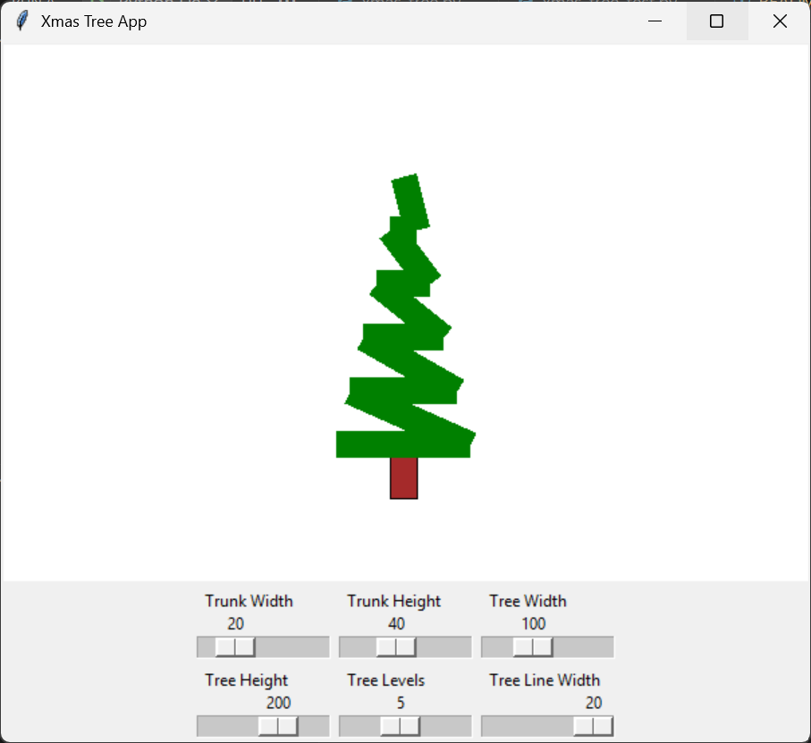

# xmas-tree-generator


A Python application for programmatically generating a Christmas tree with line segments.

<p align="center">
  
</p>

## Getting Started
To get started, clone the repository and install the required dependencies:
```bash
git clone https://github.com/michaelriedl/xmas-tree-generator.git
cd xmas-tree-generator
pip install .
```

## Usage
To generate a Christmas tree, run the following command:
```bash
python run.py
```

## Testing
To run the tests, execute the following command:
```bash
pytest
```
